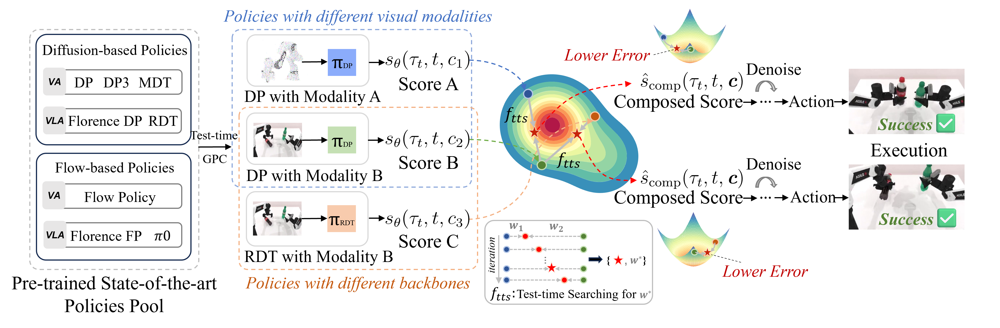

<h1 align="center">
	General Policy Composition (GPC)<br>
</h1>

<p align="center">
  <a href=''>
    
  </a>
  <a href='https://github.com/SageCao1125/GPC-Site/GPC_paper.pdf' style='padding-left: 0.5rem;'>
    
  </a>
  <a href='https://sagecao1125.github.io/GPC-Site/' style='padding-left: 0.5rem;'>
    
  </a>
</p>


<p align="center" >
<a href="https://sagecao1125.github.io/">Jiahang Cao</a><sup>*1,2,3</sup>, 
<a href="https://openreview.net/profile?id=~Yize_Huang1">Yize Huang</a><sup>*1,4</sup>, 
<a href="https://scholar.google.com/citations?user=q3x6KsgAAAAJ">Hanzhong Guo</a><sup>1</sup>, 
<a href="https://openreview.net/profile?id=~Mu_Nan2">Mu Nan</a><sup>1</sup>, 
<a href="https://openreview.net/profile?id=~Rui_Zhang27">Rui Zhang</a><sup>1</sup>, 
<a href="https://scholar.google.com/citations?user=6nUpVxIAAAAJ&hl">Weijian Mai</a><sup>1</sup>, 
<a href="https://scholar.google.com/citations?user=DjQT_G0AAAAJ">Jiaxu Wang</a><sup>5</sup>, 
<a href="https://chaducheng.github.io/">Hao Cheng</a><sup>5</sup>, 
<a href="https://openreview.net/profile?id=~Jingkai_SUN1">Jingkai Sun</a><sup>1</sup>, 
<a href="https://openreview.net/profile?id=~Gang_Han1">Gang Han</a><sup>2</sup>, 
<a href="https://openreview.net/profile?id=~Wen_Zhao2">Wen Zhao</a><sup>2</sup>, 
<a href="https://github.com/jonyzhang2023">Qiang Zhang</a><sup>2</sup>, 
<a href="https://openreview.net/profile?id=~Yijie_Guo3">Yijie Guo</a><sup>2</sup>, 
<a href="https://scholar.google.com/citations?user=jrX2FekAAAAJ">Qihao Zheng</a><sup>3</sup>, 
<a href="https://cf-song.github.io/">Chunfeng Song</a><sup>3</sup>, 
<a href="https://scholar.google.com/citations?user=dGZ3vH8AAAAJ">Xiao Li</a><sup>4</sup>, 
<a href="http://luoping.me/">Ping Luo</a><sup>1</sup>, 
<a href="https://andrewluo.net/">Andrew F. Luo</a><sup>1&nbsp;‡</sup>


<sup>1</sup>The University of Hong Kong <sup>2</sup>Beijing Innovation Center of Humanoid Robotics <sup>3</sup>Shanghai AI Lab <sup>4</sup>Shanghai Jiaotong University <sup>5</sup>The Hong Kong University of Science and Technology 

</p>


<div align="center">
  
</div>

We propose General Policy Composition (GPC), a training-free method that enhances performance by combining the distributional scores of multiple pre-trained policies via a convex combination and test-time search. GPC is versatile, allowing for the plug-and-play composition of heterogeneous policies, including VA and VLA models, as well as those based on diffusion or flow-matching, irrespective of their input visual modalities.

---
**Note**: This repository as well as the following guidelines are based on [RoboTwin-1.0](https://github.com/RoboTwin-Platform/RoboTwin/tree/RoboTwin-1.0), thanks for the authors' open resoure which greatly contributes to the community.

# 💻 Installation & 📚 Data Preparation

Please carefully follow the guidelines in [RoboTwin-1.0](https://github.com/RoboTwin-Platform/RoboTwin/tree/RoboTwin-1.0) for installation and data generation.


# 🧑🏻‍💻 Usage 
## Step 1. Prepare the pre-trained single modality-based diffusion policies
### 1. Task Running and Data Collection
Running the following command will first search for a random seed for the target collection quantity (default is 100), and then replay the seed to collect data.

```
bash run_task.sh ${task_name} ${gpu_id}
```
### 2. Training the diffusion policy as well as the 3D diffusion policy
#### (1) Diffusion Policy
The DP code can be found in `policy/Diffusion-Policy`.

Process Data for DP training:
```
python script/pkl2zarr_dp.py ${task_name} ${head_camera_type} ${expert_data_num}
# As example: python script/pkl2zarr_dp.py dual_bottles_pick_hard L515 100, which indicates preprocessing of 100 dual_bottles_pick_hard task trajectory data using L515 camera.
```

Then, move to `policy/Diffusion-Policy` first, and run the following code to train DP:
```
bash train.sh ${task_name} ${head_camera_type} ${expert_data_num} ${seed} ${gpu_id}
# As example: bash train.sh dual_bottles_pick_hard L515 100 0 0
```

#### (2) 3D Diffusion Policy
The DP3 code can be found in `policy/3D-Diffusion-Policy`.

Process Data for DP3 training:
```
python script/pkl2zarr_dp3.py ${task_name} ${head_camera_type} ${expert_data_num}
# As example: python script/pkl2zarr_dp3.py dual_bottles_pick_hard L515 100
```

Then, move to `policy/3D-Diffusion-Policy` first, and run the following code to train DP3:
```
bash train_ddpm.sh ${task_name} ${head_camera_type} ${expert_data_num} ${seed} ${gpu_id}
# As example: bash train_ddpm.sh dual_bottles_pick_hard L515 100 0 0
```
**Note**: One key difference between our training settings and RoboTwin's default configuration is that we need to align the action distribution space. This means that **the noise scheduler for both DP and DP3 needs to be consistent**, including aspects such as prediction type and inference time steps. To achieve this, we align DP3's noise scheduler with DP's default DDPM scheduler (in principle, as long as both schedulers are consistent, this is not limited to DDPM). This ensures that the action spaces of both policies remain aligned during inference sampling.

## Step 2. Compose the pre-trained policies via distribution-level composition

Move to `policy/3D-Diffusion-Policy` first, then run the following code to evaluate MCDP for a specific task for 100 times:
```
bash eval_composed.sh ${task_name} ${head_camera_type} ${expert_data_num} ${checkpoint_num} ${seed} ${gpu_id} ${dp_w} ${dp3_w}
# As example: # bash eval_composed.sh dual_bottles_pick_hard L515 100 3000 0 0 0.3 0.7
```


# 🏄‍♂️ Experiment 
## Simulation Results
For each task, we evaluated the baseline performance under L515 (320×180 resolution, FOV 45°) camera.
The DP_img and DP_pcd correspond to the diffusion policy based on RGB images (i.e.,, DP) and point cloud (i.e.,, DP3), respectively. We reproduced the DP and DP3 (without using point cloud color) with random seed 0.


## 🔎 Findings
1. When both DPs have moderate accuracy (both 30%), MCDP often achieves higher accuracy under appropriate weight configurations compared to unimodal DPs.
2. When one DP has significantly lower accuracy, MCDP struggles to surpass the highest accuracy of the better-performing unimodal DP.
3. Building on Finding 1, the improvement of MCDP is maximized when the better-performing unimodal DP holds a larger weight in MCDP.


# 😺 Acknowledgement
Our code is generally built upon: [RoboTwin](https://github.com/TianxingChen/RoboTwin), [3D Diffusion Poliy](https://github.com/YanjieZe/3D-Diffusion-Policy), [Diffusion Policy](https://github.com/real-stanford/diffusion_policy). We thank all these authors for their nicely open sourced code and their great contributions to the community. 

# 👍 Citation
```
TBD
```

# 🏷️ License
This repository is released under the MIT license. See [LICENSE](./LICENSE) for additional details.


